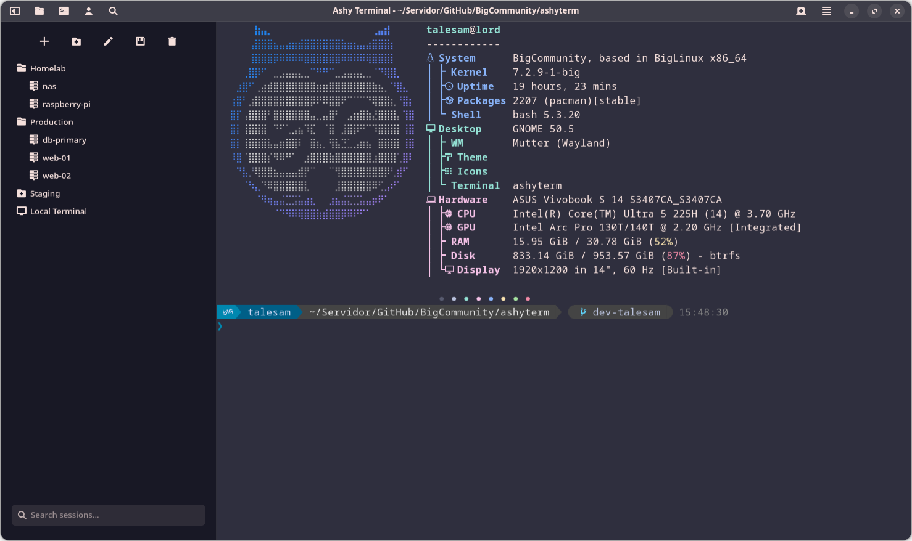
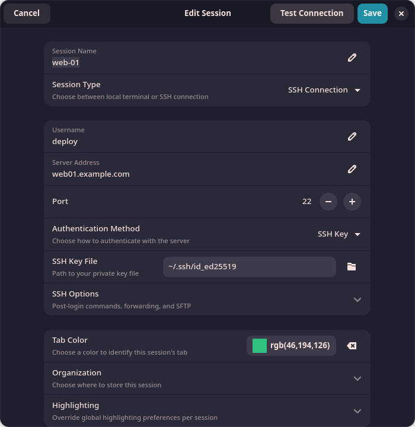
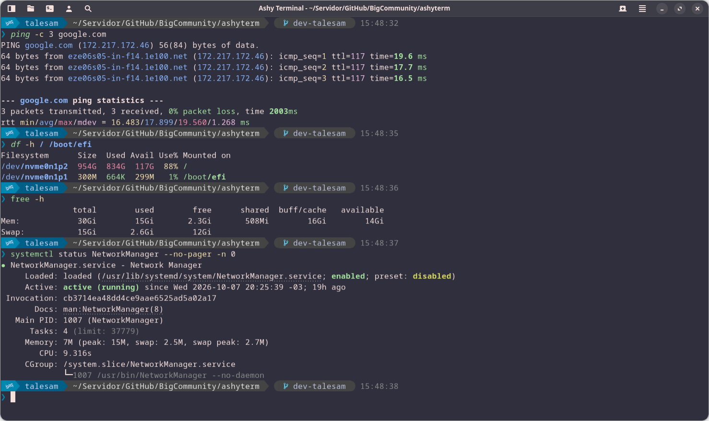
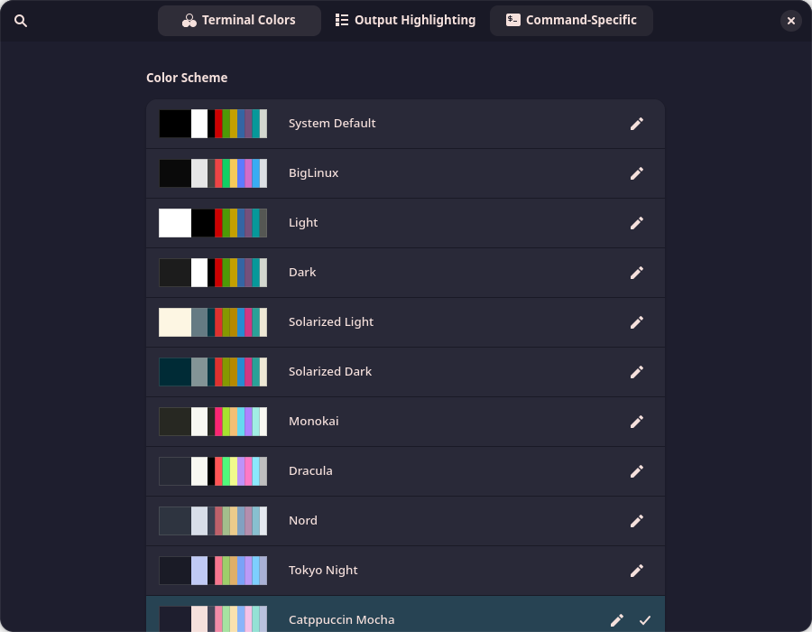
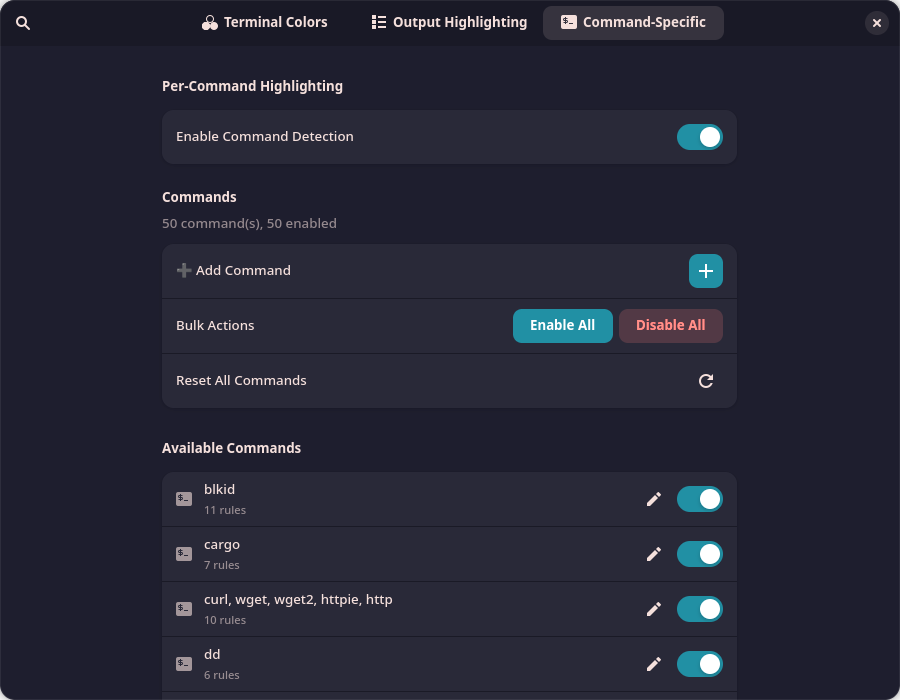
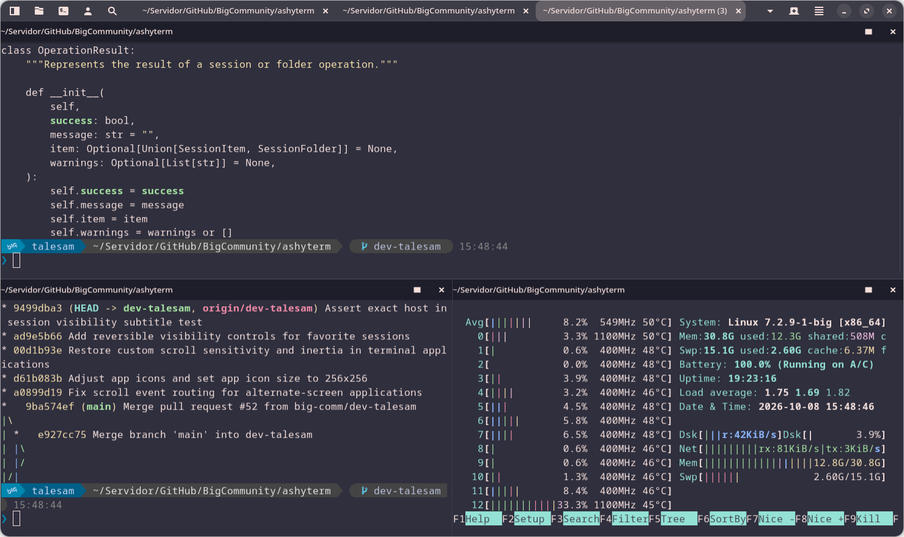
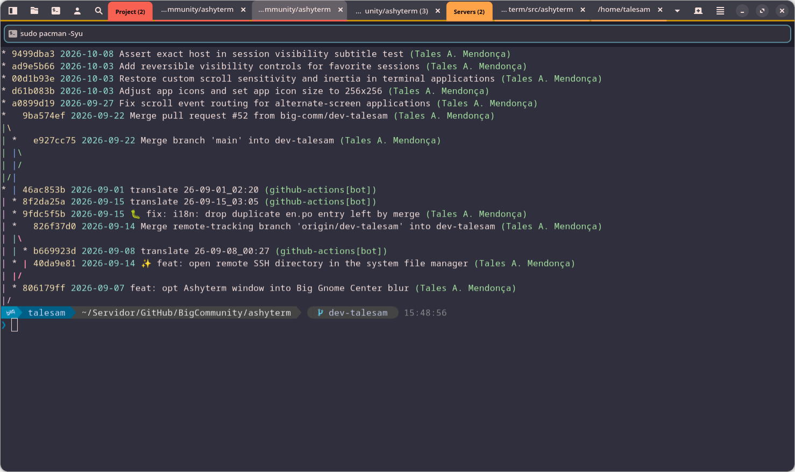
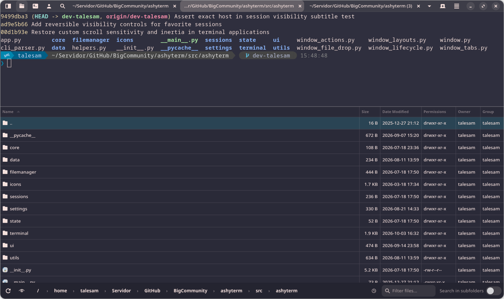
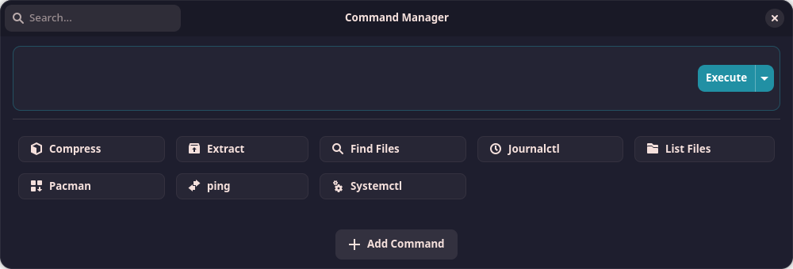
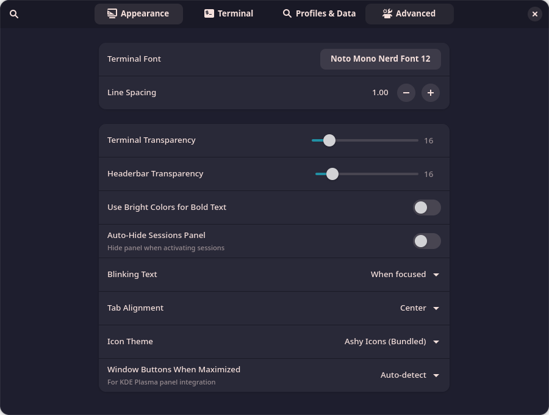

<p align="center">
  
</p>

<h1 align="center">Ashy Terminal</h1>

<p align="center">
  <strong>A modern GTK4 / libadwaita terminal emulator with SSH session management, an integrated file manager and smart output highlighting.</strong>
</p>

<p align="center">
  <a href="https://github.com/big-comm/ashyterm/releases"></a>
  <a href="LICENSE"></a>
  
  
  <a href="https://communitybig.org"></a>
</p>

<p align="center">
  <a href="#features">Features</a> •
  <a href="#installation">Installation</a> •
  <a href="#usage">Usage</a> •
  <a href="#configuration">Configuration</a> •
  <a href="#contributing">Contributing</a>
</p>

<p align="center">
  
</p>

**Ashy Terminal** is a terminal built with GTK4 and Adwaita for Linux desktops. It covers what developers and system administrators expect — SSH sessions, split panes, tab groups, remote file transfer — and it also makes the command line friendlier for newcomers by colorizing command output automatically, without touching your shell configuration.

It ships as the **default terminal on [BigLinux](https://www.biglinux.com.br/) and [BigCommunity](https://communitybig.org/)**.

## Features

### Sessions and SSH

<p align="center">
  
</p>

- **Session manager** — save Local, SSH and SFTP sessions, organize them in folders, color-code their tabs and search them from the sidebar.
- **SSH done right** — key or password authentication (passwords stored in GNOME Keyring / KWallet via libsecret), ControlMaster connection reuse, ProxyJump, port forwarding, X11 forwarding and post-login commands.
- **`~/.ssh/config` import** — hosts from your SSH config show up automatically.
- **Quick connect** — `ashyterm --ssh user@host` or the quick-connect action.

### Smart output highlighting

<p align="center">
  
</p>

Colors are applied **inside Ashy Terminal**, not by your shell — no changes to `.bashrc` / `.zshrc` needed. That makes it just as useful on servers, containers and restricted environments where you can't customize the shell.

- **Command-aware rules** — 50+ rule sets applied automatically for tools such as `ping`, `docker`, `systemctl`, `ip`, `lsblk`, `git`, `kubectl` and more.
- **Pattern highlighting** — IP addresses, UUIDs, URLs, errors and warnings stand out in any output.
- **`cat` with syntax highlighting** — source files printed with `cat` are colorized via Pygments.
- **Live input highlighting** — commands are colorized as you type (optional).

<table>
  <tr>
    <td></td>
    <td></td>
  </tr>
  <tr>
    <td align="center"><em>Built-in color schemes, all editable</em></td>
    <td align="center"><em>Per-command rules you can toggle, edit or add</em></td>
  </tr>
</table>

Every rule is customizable: foreground and background colors, **bold**, *italic*, underline, ~~strikethrough~~ and blinking text for critical information.

### Split panes and tab groups

<p align="center">
  
</p>

- **Split panes** horizontally and vertically, maximize a single pane and rebalance them; save and restore complete **layouts**.
- **Tab groups** — Chrome-style color-coded groups that can be collapsed, reordered by drag and drop, and auto-joined.
- **Live directory tracking** — tab titles follow the current working directory (OSC 7), with the full path in the tooltip.

<p align="center">
  
</p>

- **Input broadcasting** — type a command once and send it to several tabs and panes at the same time.

### Integrated file manager

<p align="center">
  
</p>

- **Side panel that follows the terminal** — browse local and remote (SFTP) file systems; it tracks the shell's current directory.
- **Remote editing** — open a remote file in your local editor; Ashy watches it and uploads every save.
- **Drag and drop transfers** — drop files on the terminal to upload them to the remote host (rsync when available, SFTP otherwise).
- **Transfer manager** — progress and history for uploads and downloads.

### Command manager

<p align="center">
  
</p>

Ready-to-use command forms (compress, extract, find files, `journalctl`, `pacman`, `systemctl`, …) for people who don't remember every flag — and you can add your own.

### Optional AI assistant

A fully **opt-in** side panel that connects your terminal to an LLM. Nothing is sent unless you explicitly select text and ask for it.

- Providers: **Groq**, **Google Gemini**, **OpenRouter** and **local models** (Ollama, LM Studio).
- Distribution-aware answers, persistent chat history and click-to-run command suggestions.

### Deep customization

<p align="center">
  
</p>

Fonts, line spacing, terminal and headerbar transparency, cursor, scrollback, scroll sensitivity, icon theme, tab appearance and fully configurable keyboard shortcuts. Settings and sessions can be exported to an encrypted 7z backup.

## Installation

### BigLinux / BigCommunity

Ashy Terminal comes **pre-installed** as the default terminal. Nothing to do.

### Arch Linux / Manjaro (build from source)

`libchildenv` is optional but recommended for long sessions. It enables allocator
preloading (mimalloc/tcmalloc/jemalloc) and removes `LD_PRELOAD` from child processes,
so terminal commands do not inherit the custom allocator. Without it, Ashy skips
the memory optimization even if mimalloc is installed.

```bash
sudo pacman -S --needed base-devel git

# Recommended: keeps Ashy's memory usage stable in long sessions
git clone https://github.com/biglinux/libchildenv.git
cd libchildenv/pkgbuild && makepkg -si && cd ../..

git clone https://github.com/big-comm/ashyterm.git
cd ashyterm/pkgbuild
makepkg -si
```

### Nix

```bash
# Run without cloning
nix run github:big-comm/ashyterm

# Variant with all optional dependencies
# (also available: ashyterm-performance, ashyterm-highlighting, ashyterm-backup)
nix run github:big-comm/ashyterm#ashyterm-all

# Development shell from a local clone
nix develop
python -m ashyterm
```

| Package | Extra dependencies | Description |
|---------|--------------------|-------------|
| `ashyterm` | — | Base terminal emulator |
| `ashyterm-performance` | `regex` | Faster highlighting regex engine |
| `ashyterm-highlighting` | `Pygments` | Syntax highlighting support |
| `ashyterm-backup` | `py7zr` | Encrypted 7z backup / restore |
| `ashyterm-all` | all of the above | Every optional dependency |

### Run from source

```bash
git clone https://github.com/big-comm/ashyterm.git
cd ashyterm

# Run without installing
PYTHONPATH="$PWD/src" python -m ashyterm

# Or install for the current user
python -m pip install --user .
ashyterm
```

### Dependencies

| Type | Packages |
|------|----------|
| Runtime | Python 3.8+, GTK 4, libadwaita 1, VTE for GTK4 (`vte4`), PyGObject, pycairo, libsecret |
| Python | `requests`, `psutil`, `setproctitle`, `regex`, `Pygments`, `py7zr`, `asyncssh` |
| Tools | `openssh`, `rsync` (fast transfers, falls back to SFTP), `sshpass` (only for SSH password auth) |

On Arch / Manjaro:

```bash
sudo pacman -S gtk4 libadwaita vte4 libsecret python-gobject python-cairo python-requests \
  python-psutil python-setproctitle python-regex python-pygments python-py7zr \
  python-asyncssh openssh rsync sshpass
```

## Usage

```bash
ashyterm [OPTIONS] [DIRECTORY]
```

| Option | Description |
|--------|-------------|
| `-w, --working-directory DIR` | Working directory for the initial terminal |
| `-e, -x, --execute COMMAND ...` | Execute a command on startup (all remaining arguments are included) |
| `--close-after-execute` | Close the tab when the command finishes |
| `--ssh [USER@]HOST[:PORT][:/PATH]` | Connect straight to an SSH host |
| `--new-window` | Open a new window instead of a tab |
| `-d, --debug` | Enable debug mode |
| `--log-level LEVEL` | `DEBUG`, `INFO`, `WARNING`, `ERROR` or `CRITICAL` |
| `-v, --version` / `-h, --help` | Show version / help |

```bash
ashyterm ~/projects                         # open in a directory
ashyterm -e htop                            # run a command
ashyterm --ssh admin@server.example.com     # connect over SSH
ashyterm --close-after-execute -e "ls -la"  # run and close
```

## Configuration

Everything lives in `~/.config/ashyterm/`:

| Path | Contents |
|------|----------|
| `settings.json` | Preferences, appearance, terminal behavior, shortcuts and AI settings |
| `sessions.json` | Saved sessions and folders |
| `session_state.json` | Window state and session restore data |
| `layouts/` | Saved split-pane layouts |
| `highlights/` | Your custom highlighting rules (bundled rules live in `data/highlights/`) |
| `backups/` | Encrypted backup archives |
| `logs/` | Application logs (when logging to file is enabled) |

## Contributing

Contributions are welcome!

1. Fork the repository and create a branch: `git checkout -b feature/my-feature`
2. Make your change and run the test suite: `pytest tests/ -q`
3. Commit, push and open a Pull Request.

See [AGENTS.md](AGENTS.md) for the project layout and coding conventions.

## License

Released under the [MIT License](LICENSE).

## Acknowledgments

- The **BigCommunity** and **BigLinux** teams.
- The developers of **GNOME**, **GTK**, **VTE** and **Pygments**.
